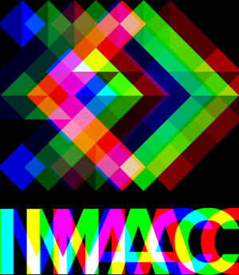
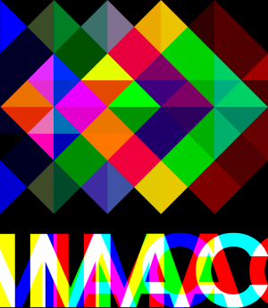
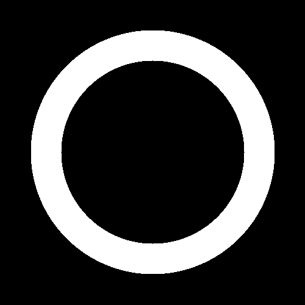
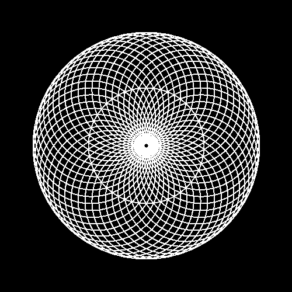
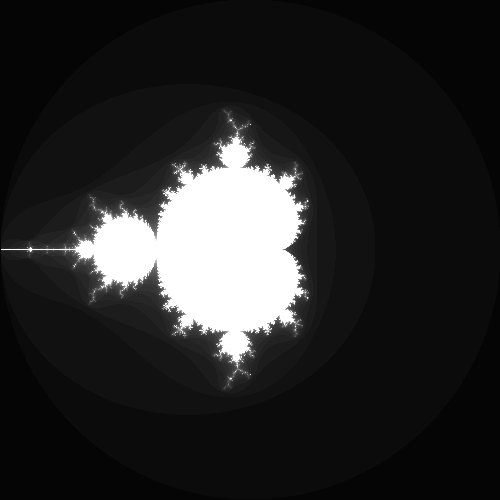

# S1 | Prog: Workshop c++
## Beaujault Sarah & Jan Agathe

---

### Exercice 1 : Ne garder que le vert
 

---
### Exercice 2 : échange les canaux
 
---
### Exercice 3 : Noir et blanc /
 
---

### Exercice 4 : Négatif
 

---
### Exercice 5 : Dégradé S
**Fonctionnement** :
On part d'une image totalement noir, puis on éclairci chaque pixel en fonction de leurs colonnes.


---

### Exercice 6 : Miroir
 

---
### Exercice 7 : Image Bruité A S
####Version de Sarah 
**Fonctionnement** :
Pour chaque pixels qui compose l'image, on determine aléatoirement si ce pixel est bruité ou non. Si oui on l'associe à une couleur choisie elle aussi aléatoirment.

 

**Problemme rencontré**

Dans la première version du code, je determinais si un pixel été brouité ou non avec cette partie du code : 
`int isPixelBruit {random_int(0, 4)};
if (isPixelBruit = 1)`
Cependant avec cette formule il est impossible de de choisir une fréquence de bruit telle que 1/28 par exemple. 
Le code final contient ces ligne qui permettent de pouvoir choisir avec beaucoup plus de précision le taux de bruit sur l'image final 
`float rand{random_float(0.f, 1.f)};
        if (rand < 0.28f)`

---
### Exercice 9 : RGB Split S
**Fonctionnement** :
La fonction crée une copie de l'image d'origine, puis sépare les composantes rouge, bleue et verte de l'image d'origine pour les placer respectivement du côté droit, gauche et au centre de l'image copiée. La escpacemnt entre les couleurs est choisit en argument.

 

**Remarque**

Si chaques couleurs sont escpacé de 1/5 de la taille de l'image d'origine alors le résultat ressemble à un effet arlequin 




---
### Exercice 10 : Luminosité S

La fonction ajuste la luminosité de chaque pixel en élevant chaque composante de couleur à la puissance 0.6. Cela a pour effet de réduire l'intensité lumineuse globale de l'image.

 
---
### Exercice 11 : Disque S

---
### Exercice 12 : Cercle S

---
### Exercice 13 : Rosace S
**Fonctionnement**

Les coordonnées du centre et le rayon du cercle central sont définis, puis une boucle génère les coordonnées des cercles périphériques en fonction du nombre de cercles spécifié (nb_circles). Ces coordonnées sont calculées en utilisant les fonctions trigonométriques cos et sin pour répartir les cercles uniformément autour du cercle central. Chaque cercle est ensuite dessiné à l'aide de la fonction dessineCercle.



### Exercice 14 : Mosaïque
 


### Exercice 15 : Mosaïque miroir
 

### Exercice 16 : Glitch S
**Fonctonnemnt**

La fonction crée une version glitchée d'une' image en remplaçant des portions aléatoires de l'image par des segments provenant d'autres parties de l'image. Le nombre de glitches et les paramètres spécifiques de chaque glitch (position, longueure, largeure) sont déterminés de manière aléatoire.

 

---
### Exercice 17 : Tramage
 
---
### Exercice 18 : Vortex S
  

**Problemme rencontré**

Dans ma première version du programme, j'ai attribué aux pixel de l'image d'origine aux pixels de l'image final avec pour coordonné les points après rotation. Or en faisent cette méthode nous nous retrouvons avec certins pixels noirs alors qu'ils devraient être coloré, cela est dû au fait qu'après rotation, certins pixels se retrouvent entre deux pixels de l'image d'origine.
`imageVortex.pixel(nouveau_point.x, nouveau_point.y) = image.pixel(x,y);`
Résultat :


Il faut donc atribuer aux pixels de l'image final, la couleur des pixels d'origine après rotation
`imageVortex.pixel(x,y) = image.pixel(nouveau_point.x, nouveau_point.y);`

---
### Exercice 19 : Normalisation de l'Histogramme S

 

**Problème rencontré **

Ma première version du programme se trouvait être fausse car je m'étais tromper dans la formule à utilisé cependant l'image enregistrée avait bien une plus grande profondeur de couleur. 
Formule utilisé :
`color = color * (1/hight_brightness) - low_brightness;`
Résultat :


---
### Exercice 20 : Convolution
 
---
### Exercice 21 : Fractale S


**Problème rencontré**

La première fois que j'ai essayé de faire toourner le programme je n'ai pas reussie car j'ai oublié de mettre le `static_cast<float>`

---


### Exercice 22 : Emboss
 

### Exercice 23 : Outline
 

### Exercice 24 : Sharpen
 


*Italique*

**Gras**

[lien](https://github.com/dsmtE/Learn--cpp_programming)


#### Titre (plus ou moins gros en fonction du nombre de #)

- Listes
- avec
- plusieurs items

```cpp
// Bloc de code C++
int x{0};
std::cout << "x vaut " << x << '\n';
```

Bout de code `int x{0};` au milieu d'une phrase.

Équations de math avec LaTeX :
$$
\int_{-\inf{}}^{+\inf{}} x^2 dx
$$

Notes de bas de page [^1]

[^1]: Je suis une note de bas de page !

> Citation

| Tableaux      | 😁        | ✨  |
| ------------- |:-------------:| -----:|
| col 3 is      | right-aligned | $1600 |
| col 2 is      | centered      |   $12 |
| zebra stripes | are neat      |    $1 |

Séparateur :

---